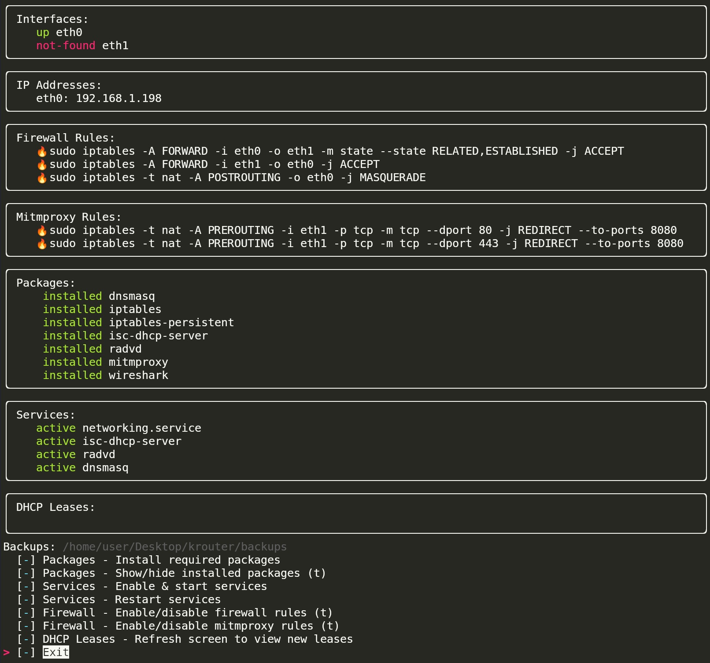

<p align="center">
	
</p>

# Krouter
This Python script configures Kali Linux to function as a router, DHCP, and DNS server. Additionally, it facilitates Man-in-the-Middle (MitM) attacks using Mitmproxy and Wireshark.
Features

- Router Configuration: Sets up Kali Linux as a network router.
- DHCP Server: Configures DHCP server to assign IP addresses to connected devices.
- DNS Server: Sets up DNS server for domain name resolution.
- Wireless Access Point: Configures a wireless access point using hostapd.
- MitM Attack Facilitation: Leverages Mitmproxy and Wireshark for traffic interception and analysis.
### Requirements

    Kali Linux
    Python 3.x
    isc-dhcp-server
    dnsmasq
    iptables
    radvd

### Installation

 Clone the repository:
```
git clone https://github.com/b34mr/krouter.git
cd krouter
```

Install the required dependencies:
```
sudo python -m pip install -r requirements.txt
```

### Configuration

The script uses the krouter/config/config.ini file for customizable settings. You can modify this file to suit your network configuration needs.

Example config.ini:
```
[interface]
wan = eth0
lan = eth1
wlan = wlan0

[firewall-router]
rule1 = sudo iptables -A FORWARD -i ${interface:wan} -o ${interface:lan} -m state --state RELATED,ESTABLISHED -j ACCEPT
rule2 = sudo iptables -A FORWARD -i ${interface:lan} -o ${interface:wan} -j ACCEPT
rule3 = sudo iptables -t nat -A POSTROUTING -o ${interface:wan} -j MASQUERADE
# Wireless Interface
rule4 = sudo iptables -A FORWARD -i ${interface:wan} -o ${interface:wlan} -m state --state RELATED,ESTABLISHED -j ACCEPT
rule5 = sudo iptables -A FORWARD -i ${interface:wlan} -o ${interface:wan} -j ACCEPT

[firewall-mitmproxy]
rule1 = sudo iptables -t nat -A PREROUTING -i ${interface:lan} -p tcp -m tcp --dport 80 -j REDIRECT --to-ports 8080
rule2 = sudo iptables -t nat -A PREROUTING -i ${interface:lan} -p tcp -m tcp --dport 443 -j REDIRECT --to-ports 8080

[packages]
dnsmasq
hostapd
iptables
iptables-persistent
isc-dhcp-server
radvd
mitmproxy
wireshark

[network-interfaces]
fp = /etc/network/interfaces
option = auto lo
	iface lo inet loopback
	auto ${interface:lan}
	iface ${interface:lan} inet6 static
	address 2001:db8:0:1::10
	netmask 64
	iface ${interface:lan} inet static
	address 192.168.52.1/24
	## Wireless Interface
	#auto ${interface:wlan}
	#iface ${interface:wlan} inet static
	#address 192.168.42.1/24
...
[TRUNCATED]
...

```

### Wireless Access Point Configuration

Set wireless interface under '[interface]' 'wlan'.

```

[interface]
wan = eth0
lan = eth1
wlan = wlan0

```

Uncomment the 'Wireless Interface' areas unders the '[network-interfaces]' and '[dhclient]' sections.

```
[network-interfaces]
fp = /etc/network/interfaces
option = auto lo
	iface lo inet loopback
	auto ${interface:lan}
	iface ${interface:lan} inet6 static
	address 2001:db8:0:1::10
	netmask 64
	iface ${interface:lan} inet static
	address 192.168.52.1/24
	# # Wireless Interface
	# auto ${interface:wlan}
	# iface ${interface:wlan} inet static
	# address 192.168.42.1/24

[dhclient]
fp = /etc/dhcpcd.conf
option = interface ${interface:lan}
	static ip_address=192.168.52.1/24
	static ip6_address=2001:db8:0:1::10/64
	nohook wpa_supplicant
	# # Wireless Interface
	# interface ${interface:wlan}
	# static ip_address=192.168.42.1/24
	# nohook wpa_supplicant
...

```

Set SSID and Pre-Shared Key under '[hostapd]' 'ssid' and 'wpa_passphrase'.

```
[hostapd]
fp = /etc/hostapd/hostapd.conf
option = interface=${interface:wlan}
	ssid=krouter
	channel=7
	macaddr_acl=0
	auth_algs=1
	wmm_enabled=0
	wpa=2
	wpa_passphrase=KaliRouter31337
	wpa_key_mgmt=WPA-PSK
	wpa_pairwise=TKIP
	rsn_pairwise=CCMP
...

```

### Install Packages

Run the script with root privileges:
```
sudo python krouter.py
```

Show the installed packages pane:
```
Packages - Show/hide installed packages
```

Install required packages as needed:
```
Packages - Install required packages
```

Hide the installed packages pane:
```
Packages - Show/hide installed packages
```

### Usage
Run the script with root privileges:
```
sudo python krouter.py
```

Enable and start the services:
```
Services - Enable & start services
```
*Note*: Ensure both interfaces are up, prior to starting services.

Restart Services:
```
Services - Restart services
```
*Important*: Restart the services on each run to resolve an ISC-DHCP issue with leasing out IPv4 addresses.

View DHCP Leases:
```
DHCP Leases - Refresh screen to view new leases
```

Toggle Firewall Rules on/off as needed. I.e Mitmproxy Portforwaring rules
```
Firewall - Enable/disable mitmproxy rules
```
*Note: Fire icon present when the FW rule is enabled.
### Screenshot



### Disclaimer

This script is intended for educational and ethical testing purposes only. Unauthorized use of this script is prohibited.
